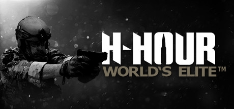
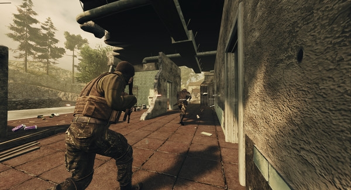
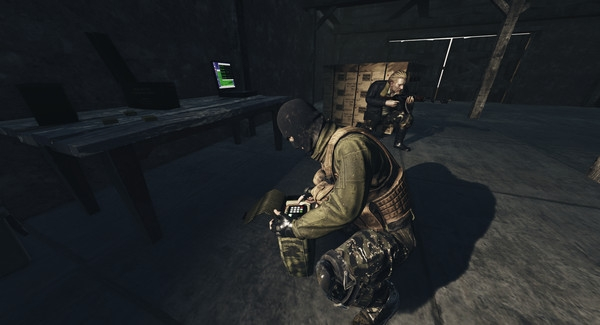

# Kevin DeRespino
## ePortfolio
### H-Hour: World's Elite

 
 
In October 2014,. we began work on H-Hour for Steam early access. We had six months to move content from Unreal Engine 3 into Unreal Engine 4 and to create the necessary functionality needed for an online shooter.
 
I gained some new responsibilities during development. I had to manage builds and distribute tasks to interns. I created weapons and ballistics. I worked on the game mode logic for various game modes such as demolition and hostage extraction. I also helped with a lot of technical art needs brought up by the art team. I worked on the Steam Workshop app to upload content created by the community. I left the project in March of 2016 when my contract was complete.
 
H-Hour: World’s Elite is currently available on Steam.  
http://store.steampowered.com/app/293220/



