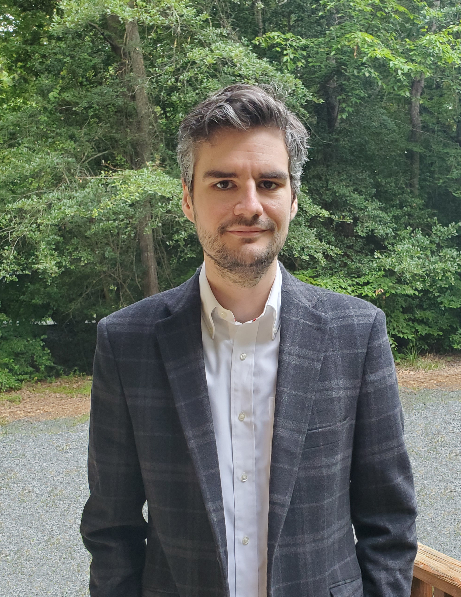
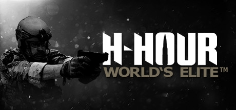
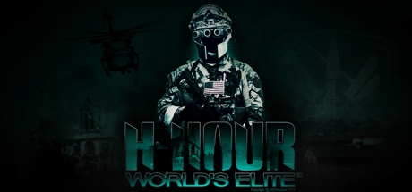
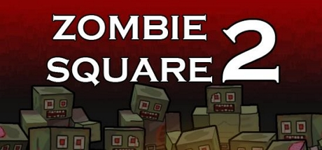
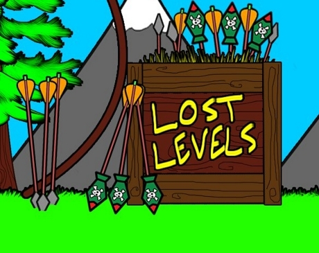
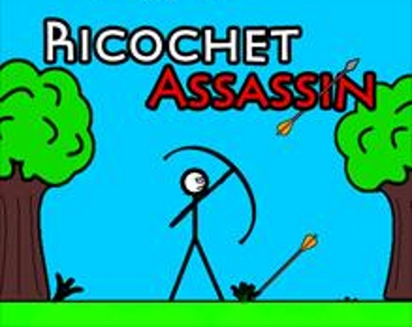
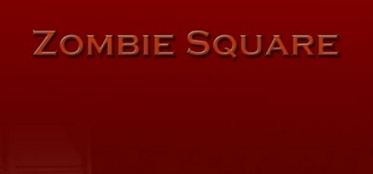

# Kevin DeRespino
## ePortfolio

### About Me

My name is Kevin DeRespino and I am an Indie Game Developer. I graduated from Southern New Hampshire University with a B.S in Computer Science and from Sandhills Community College with an A.S in Simulation and Game Design. I have shipped games on multiple platforms from mobile phones to Xbox. My independent games released to the XBox Indie Marketplace have sold over 70,000 combined units. I am proficient in C++, C# and Unreal Engine.

Game development is my passion. My first real taste of video game development was making maps for the original Doom when I was 10 years old and I have been doing it ever since. Please feel free to take a look at some of my works on this website.

  

### Games

[Ricochet Ranger](https://kevinderespino.github.io/ricochetranger)

[H-Hour: World's Elite](https://kevinderespino.github.io/hhour)

[H-Hour POC](https://kevinderespino.github.io/hhourpoc)

[Zombie Square 2](https://kevinderespino.github.io/zombiesquare2)

[Ricochet Assassin Lost Levels](https://kevinderespino.github.io/ricochetassassinll)

[Ricochet Assassin](https://kevinderespino.github.io/ricochetassassin)

[Zombie Square](https://kevinderespino.github.io/zombiesquare)

### WIP

[Zombie Square](https://kevinderespino.github.io/magicgameproject)

