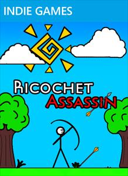
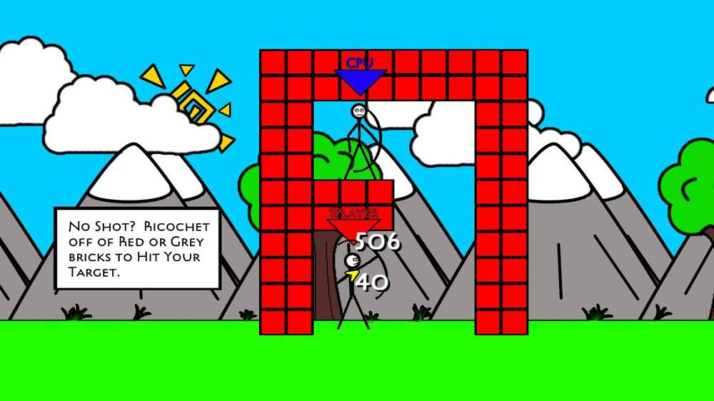
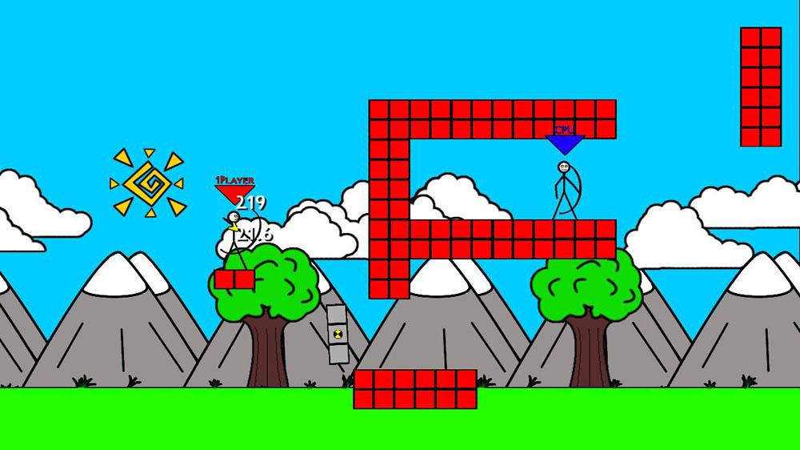

# Kevin DeRespino
## ePortfolio
### Ricochet Assassin

 

This was the second game I completed. I teamed with an artist, Jared Saunders, who did all of the artwork for Ricochet Assassin. This game was completely written in C#. In order to design the levels, I created a simple level editor that would save the levels into XML files. The levels themselves were designed by Jared and myself with the object of creating a variety of challenges for the player.
 
Ricochet Assassin is an archery puzzle game. The goal is to hit a target by ricocheting arrows off of bricks in increasingly difficult levels. This game was my first major success on the XBox Indie Arcade Marketplace. Ricochet Assassin was the number one download for two straight weeks. It has sold over 30,000 copies.  
 
It was released on XBox 360 in September 2010.
 As of 2015 Xbox Indie marketplace has been shut down. Subsequent links no longer work.
Link to the XBOX Marketplace for Ricochet Assassin:
http://marketplace.xbox.com/en-US/Product/Ricochet-Assassin/66acd000-77fe-1000-9115-d8025855065a

 

 