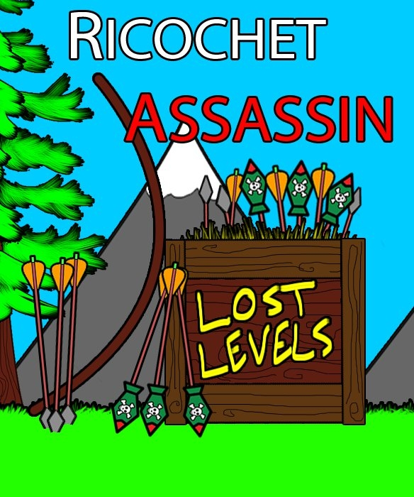
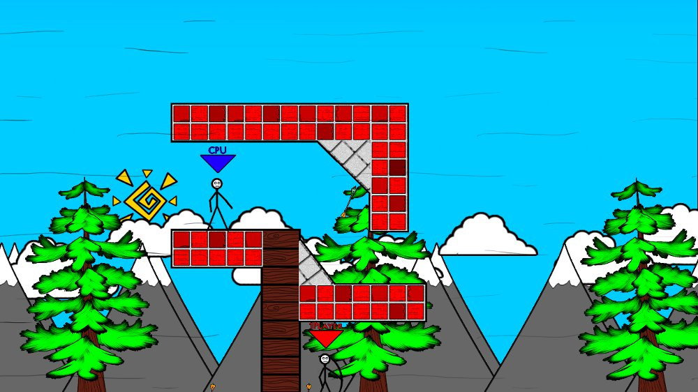
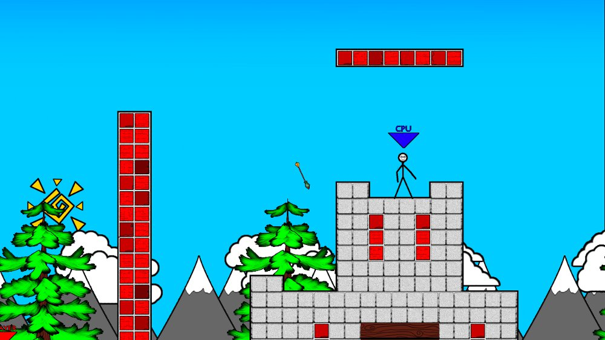

# Kevin DeRespino
## ePortfolio
### Ricochet Assassin Lost Levels

 

This was the third game I completed. I worked again with artist Jared Saunders. This was a sequel created because of the success of the first Ricochet Assassin game. Lost Levels was based off of the original code from Ricochet Assassin but included a variety of improvements.
 
Lost Levels added wind physics to create more interesting trick shots. The game featured updated art and thirty newly designed levels, created by Jared and myself. Lost Levels featured several multi-player levels in which two players took turns attempting to eliminate their opponent.
 
This game was released to the Indie Marketplace in June of 2011.
 As of 2015 Xbox Indie marketplace has been shut down. Subsequent links no longer work.
Link to the XBox Marketplace for Ricochet Assassin Lost Levels:
http://marketplace.xbox.com/en-US/Product/Ricochet-Assassin-Lost-Levels/66acd000-77fe-1000-9115-d80258550899

 

 