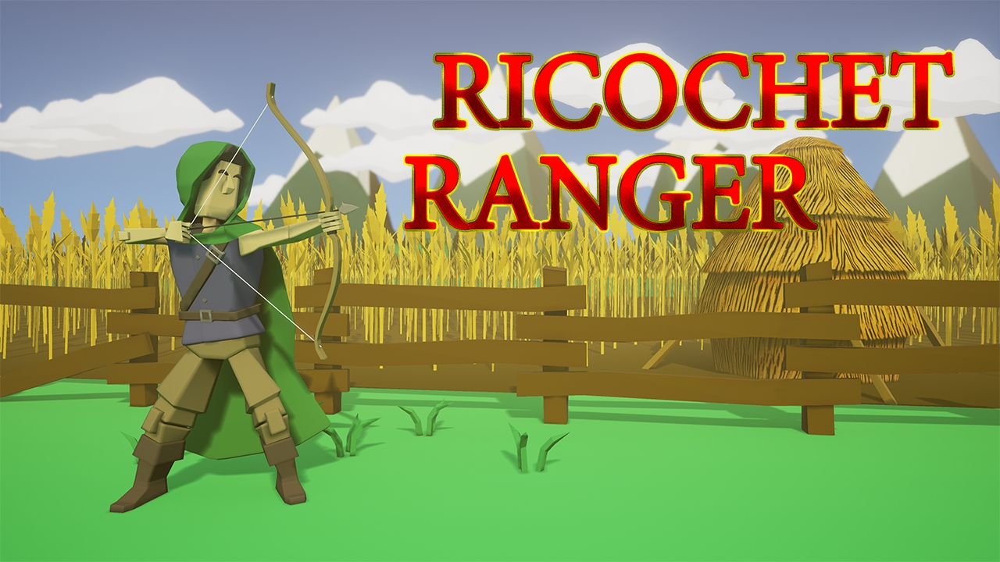
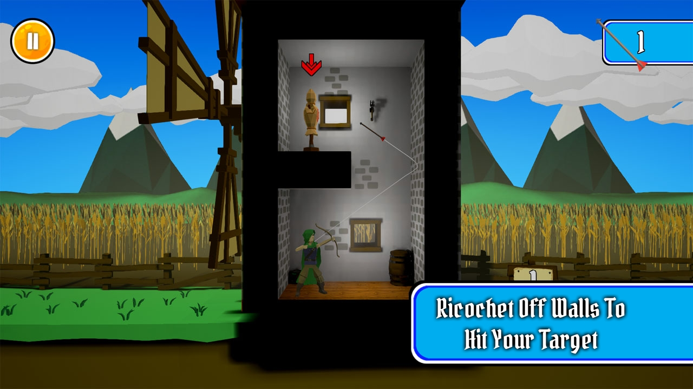
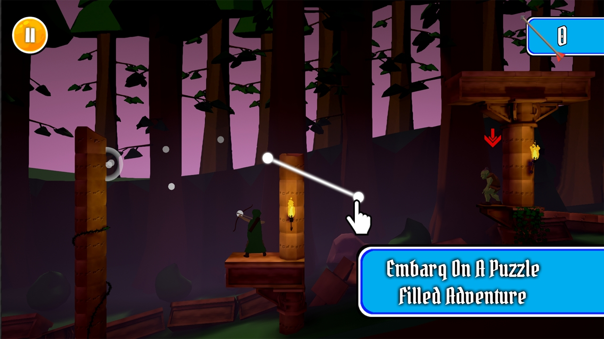
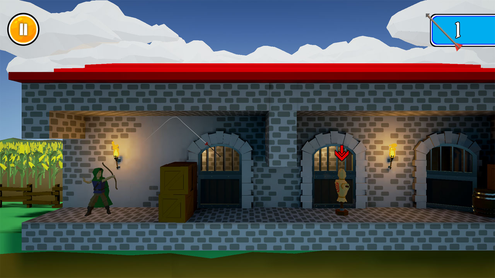

# Kevin DeRespino
## ePortfolio
### Ricochet Ranger

 
 
Ricochet Ranger was the first mobile and multiplatform game I developed.  This was a 3D version of Ricochet Assassin set in a Medieval Fantasy setting using UE4. Some goals I had for the game were to make each level feel unique and the puzzle to be a part of the environment, not just floating blocks in the air like Ricochet Assassin.  I also added story and lore to the world to drive the player.
 
On this project I did both Design and Programming.  I designed and created 25 of the 40 levels, created the ricochet prediction system, gameplay mechanics, final boss fight, character customization and UI. One of the challenges we faced when working on the game was maintaining a high quality look on mobile that ran at 30fps.  At the time of release the iPad 2 still held a large portion of the tablet market. Work was done to allow multiple levels of detail for different devices profiles.   Another problem we faced was the install size being over 100mb for iOS.  We were able to get it down to 96 mb with a lot of optimization on lightmaps, compressing of assets and removing engine dependencies.  



