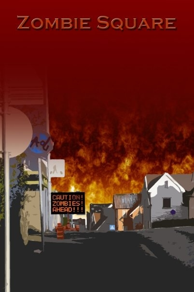
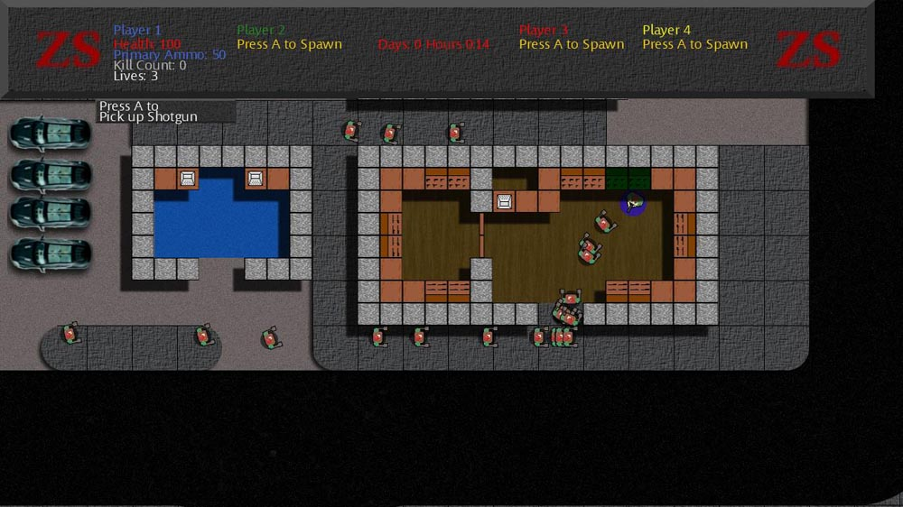

# Kevin DeRespino
## ePortfolio
### Zombie Square

 

This was the first game I completed. I did all the work myself, including coding and art. It was entirely written in C#. I started this as a final project for my Associate’s Degree in Simulation and Game Design.
 
Zombie Square is a four-player couch co-op. The goal of the game was simple: players attempted to survive as long as possible while zombies attacked. There will several shops in the game where you could buy weapons, health and energy drinks that gave you buffs.  
 
It was released on XBox 360 in April 2010.
As of 2015 Xbox Indie marketplace has been shut down. Subsequent links no longer work.
Link to the XBox Marketplace for Zombie Square: http://marketplace.xbox.com/en-US/Product/Zombie-Square/66acd000-77fe-1000-9115-d802585504a4

