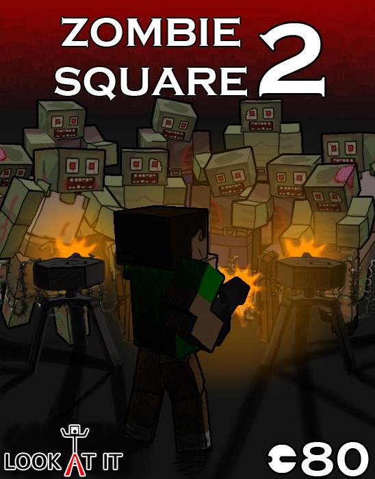
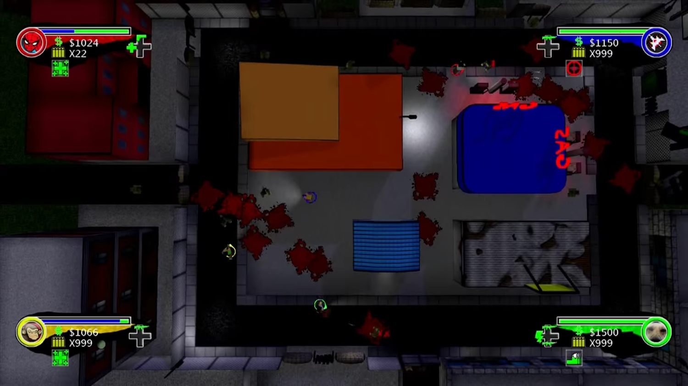
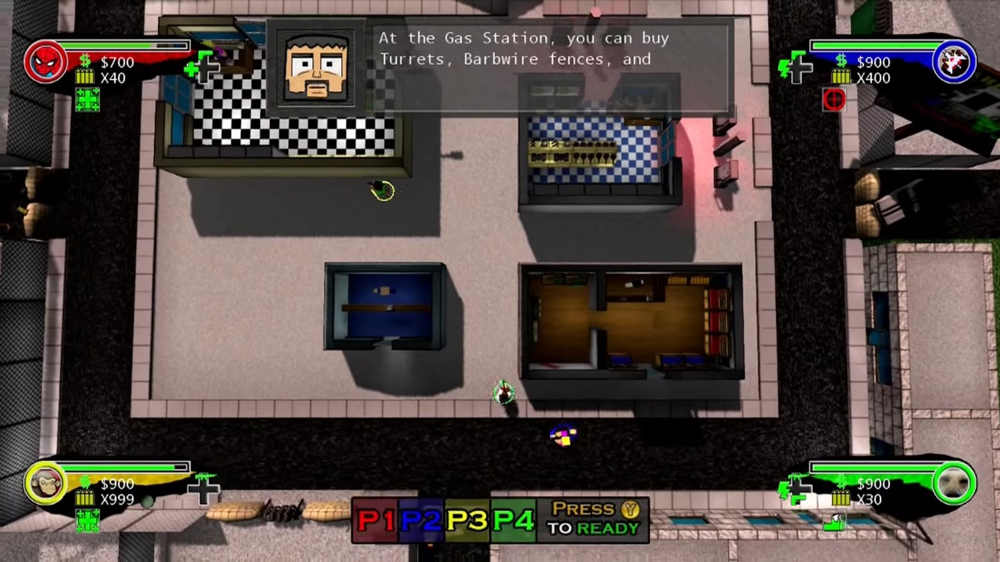

# Kevin DeRespino
## ePortfolio
### Zombie Square 2

 

This is the fourth game I completed. This was my first 3D game and the first game I programmed for which I did not write the level editor. I used the Sunburn Engine for the game. For Zombie Square 2 I worked with Jared Saunders again but this time I took care of all the environmental art and weapons. This game featured many firsts for me, including day and night cycles, cinematics and multi-threading.
 
This game was a vast improvement over my first attempt at Zombie Square. It included a storyline, character stat-tracking and 3D graphics. I always wanted to include vehicles in the first Zombie Square and this time around we were able to add them.
 
Zombie Square 2 took place in the same town square as the first game. The Mayor of Zombie Square hires a team of mercenaries to serve as zombie killers and defend the town at night. There were unlockable characters with special abilities (i.e. one specialized in explosives and another was an engineer). The purpose of the game was the survive as many waves of zombies as possible. During the day, players could move between the shops to load up on supplies or buy vehicles. During the night, zombies would pour into the town.  
 
This game was released in February 2013 to XBox 360. This game is my highest seller. It has sold around 40,000 copies to date.
As of 2015 Xbox Indie marketplace has been shut down. Subsequent links no longer work.
Link to the XBox Marketplace for Zombie Square 2:
http://marketplace.xbox.com/en-US/Product/Zombie-Square-2/66acd000-77fe-1000-9115-d80258550ca4

 

 